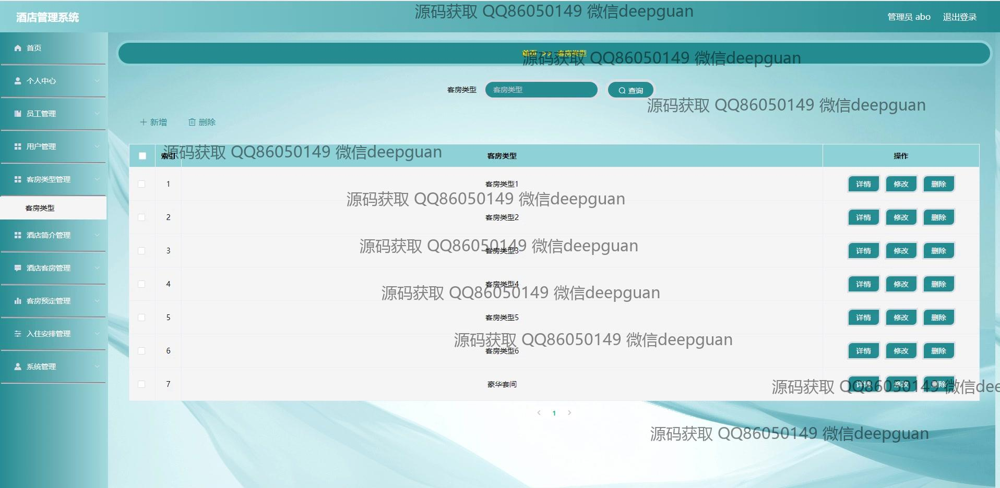
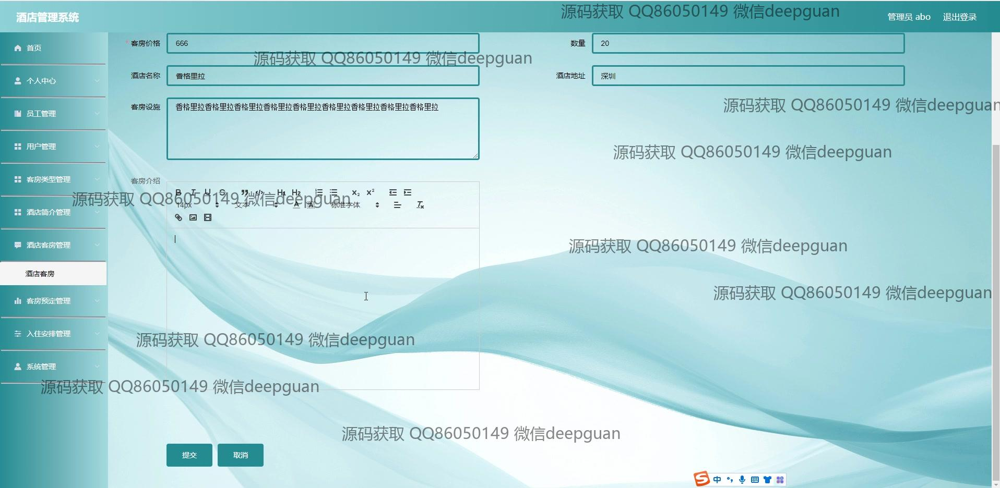

<h1 align="center">酒店管理系统</h1>

## 简介
酒店管理系统：利用Spring Boot 2.2.1开发，提供个人中心、员工管理、客房类型管理、客房预订、入住安排等功能，实现用户及后台管理，高效简便，适合酒店行业需求。    --计算机毕业设计源码；毕设源码；java毕业设计源码

## 联系方式

<h3 align="center">获取完整代码与数据库文件 + 微信：deepguan QQ: 86050149 QQ群: 783742310</h3>

<h3 align="center">可帮忙远程部署 包运行成功！提供远程部署、修改代码、设计文档指导、代码讲解等服务！</h3>

## 功能介绍（完整见运行截图）
管理员： 基本功能包括登录、注册和退出，主要职责是维护系统和管理酒店信息。管理员可以通过后台管理模块管理员工、用户、客房类型、酒店简介、酒店客房、客房预定和入住安排。同时，管理员可以编辑和更新酒店公告，上传轮播图，维护员工个人信息，查看和管理预定记录，以及处理用户评论和反馈。系统还支持对房间状态进行更新和查看入住记录，以便进行统计数据分析，提升酒店管理效率。

用户： 用户可以通过系统进行账号登录和退出，进入后可访问个人中心查看和编辑个人信息，管理收藏夹。用户还可以浏览酒店的概况、客房信息和公告。在进行客房预定时，用户可以选择客房类型、查看房间详情、上传客房图片并提交预定信息。同时，用户还可以对酒店和客房进行评论。整个用户界面设计简洁友好，便于用户查看、搜索和预定酒店房间，提升用户体验。

## 运行截图

本代码来源于网络,仅供学习参考使用!

